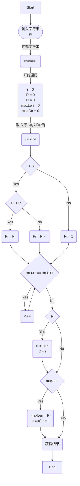

# 算法流程图

# 编译流程
## 文件结构
src文件夹中包含1个脚本：
	源代码中的注释可能变成乱码，可以看这里的注释
1. Manacher.c 
## 编译
1. 进入build目录执行cmake ..命令
2. 然后在同一目录下执行make命令。得到的可执行文件在"/Hw_W6_yh/build/bin" 当中，为"Manacher"

# 算法线性特征分析
我们首先先对算法产生复杂度的地方进行分析。整个算法并不复杂，只有两个循环，而这两个循环恰好就是复杂度产生的地方。分别是，最外层对整个字符串的遍历，以及每次当超出已探索回文串长度后需要进行的暴力拓展的while循环。
## 实验数据
在这里，我们统计了进入while循环的次数，以此来代表性地统计整个算法的运算次数。我们分别采用了10、50、100、500、1000长度的字符串进行实验。

|n|Counts|
|------------|-------------|
|10|10|
|50|51|
|100|101|
|500|577|
|1000|1010|
可以看出，我们算法的运算次数与测试集的大小之间存在着很强的线性相关性。
## 理论分析
	我们知道这个算法的时间复杂度主要由两个循环产生，因此我们将从那里下手。
我们很容易地就可以知道，最外层的for循环遍历，时间复杂度为 $\mathcal{O}(n)$,因此，我们必须证明，内层的while循环总次数为$\mathcal{O}(n)$级别的，否则时间复杂度就不可能为线性。

事实上，因为Manacher算法的特性，每当我们遍历的i在R右边界内，并且Pi也在右边界内，我们就不用进入while循环。而每当进入一次while循环，我们的右边界R就会向外暴力拓展，同时在后面的计算中我们就不用因为R而进入while循环。由此我们可以很容易的知道，while的运算次数上限为2n+1，即拓展后的字符串总长度。

这样我们就证明了该算法时间复杂度为 $\mathcal{O}(n)$。

# 运行成果展示
## 奇数长度字符串

|测试集|拓展字符串|结果|
|--------|-------|--------|
|dayuhfalurfgl|\#d\#a\#y\#u\#h\#f\#a\#l\#u\#r\#f\#g\#l\#|d|
|balufuafafdfghjhgfdfg|\#b\#a\#l\#u\#f\#u\#a\#f\#a\#f\#d\#f\#g\#h\#j\#h\#g\#f\#d\#f\#g\#|fdfghjhgfdf|
## 偶数长度字符串

|测试集|拓展字符串|结果|
|--------|-------|--------|
|sdisafglfbgakflruaib|\#s\#d\#i\#s\#a\#f\#g\#l\#f\#b\#g\#a\#k\#f\#l\#r\#u\#a\#i\#b\#|s|
| dfghjkllkj|\#d\#f\#g\#h\#j\#k\#l\#l\#k\#j\#|jkllkj|
